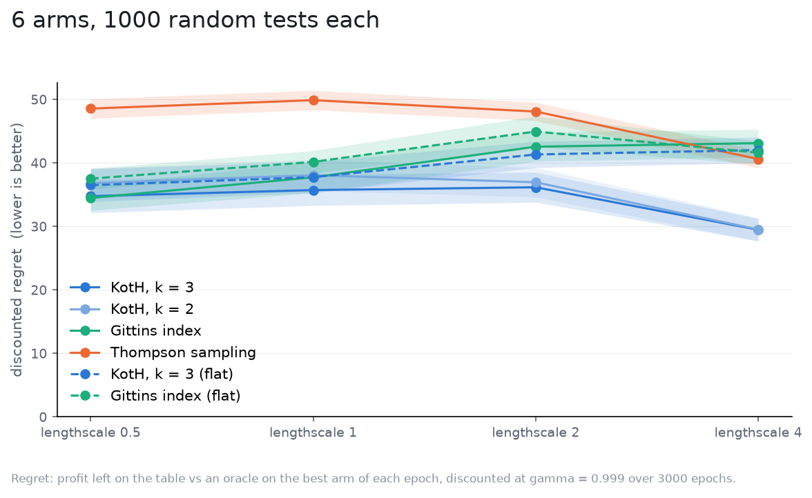

# Bids

Suppose we have a marketing campaing with six bids on a ladder, 0 to 5. The profit is a smooth function of the bid: here, we simulate that with one
draw from a Gaussian process with a Matern-5/2 kernel, so neighbouring bids
earn alike. The lengthscale (in bid steps) is how alike: at 0.5 the
six bids are nearly six unrelated arms (neighbour correlation 0.14), at 4
the profit curve is close to a line (0.95). No control: every bid is a draw.

Strategies marked with the prior start from the world's own law. koth takes
it whole, through `cov`; Thompson sampling takes it whole too, on the joint
posterior, with `P(best)` by Monte Carlo; the Gittins index takes its
diagonal, which is all an index policy holds. Two flat rows keep the baseline
in view.

Setup: `sigma = 1`, amplitude `effect_std = 0.5`, `gamma = 0.999` (`1/rho =
1000` epochs) over 3000 epochs, 1000 tests per world, the same tests in every
world ([spec](spec.yaml)).

| lengthscale | koth, k = 3 | koth, k = 2 | Gittins index | Thompson sampling | koth, k = 3 (flat) | Gittins index (flat) |
|---|---|---|---|---|---|---|
| 0.5 | 34.8 +/- 2.6 | 36.8 +/- 2.4 | 34.5 +/- 2.0 | 48.6 +/- 1.5 | 36.5 +/- 2.6 | 37.5 +/- 1.6 |
| 1 | 35.7 +/- 2.4 | 38.1 +/- 2.4 | 37.7 +/- 2.5 | 49.9 +/- 1.5 | 37.8 +/- 2.4 | 40.2 +/- 1.8 |
| 2 | 36.2 +/- 2.4 | 37.0 +/- 2.3 | 42.6 +/- 2.3 | 48.1 +/- 1.4 | 41.3 +/- 2.1 | 45.0 +/- 2.4 |
| 4 | **29.5 +/- 1.8** | **29.5 +/- 1.8** | 43.1 +/- 2.2 | 40.6 +/- 1.4 | 42.0 +/- 2.0 | 41.6 +/- 1.8 |

Discounted regret, mean and 95% CI.

What it says:

- With six unrelated bids (lengthscale 0.5) koth and Gittins tie, with or
  without the prior: this is the independent-arms world of the robustness
  chapter, and the prior buys the 5-8% the spread alone is worth.
- As the curve smooths, the strategies that hold the correlation pull away
  and the ones that cannot do not move. At lengthscale 4 koth loses 29.5
  against the Gittins index's 43.1, a third less, and against its own flat
  self's 42.0; the Gittins index with the prior is no better than without
  it (43.1 against 41.6), because the diagonal of a smooth prior says nothing
  a flat prior does not.
- Joint Thompson sampling gains too (48.6 to 40.6) and stays a third behind
  koth: knowing that bid 3 tells you about bid 4 is worth less to a strategy
  that never commits.
- k = 2 and k = 3 are one line here. On a smooth curve the third contender
  adds nothing the pair does not already say.

This is the case the package was built for. On a ladder of related arms, the
prior does the learning, and the strategy that reads it whole spends a third
less than the best strategy for unrelated arms.
