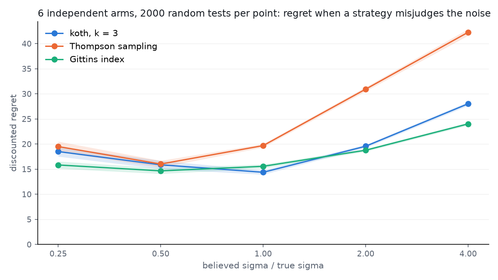

# Misjudging the noise

`sigma` is the one number a user must supply that the data does not hand over,
so: what does it cost to get it wrong? Each strategy was run believing `sigma`
to be 0.25, 0.5, 1, 2 and 4 times its true value, everything else equal. The
belief enters the strategy's filter and, for koth, its `Test`; the world does
not change.

Setup: 6 independent arms, true effects drawn from `N(0, 0.5)`, true
`sigma = 1`, `gamma = 0.99` (`1/rho = 100` epochs) over 500 epochs, flat
priors, 2000 tests per point, the same tests for every point
([spec](misspecified_sigma.spec.yaml), [script](misspecified_sigma.py)).

| believed / true | koth, k = 3 | Thompson sampling | Gittins index |
|---|---|---|---|
| 0.25 | 18.5 +/- 1.0 | 19.5 +/- 1.0 | 15.8 +/- 0.7 |
| 0.5 | 15.9 +/- 0.8 | 16.0 +/- 0.7 | 14.7 +/- 0.6 |
| 1 | **14.4 +/- 0.4** | 19.7 +/- 0.4 | 15.6 +/- 0.4 |
| 2 | 19.6 +/- 0.3 | 30.9 +/- 0.4 | 18.8 +/- 0.3 |
| 4 | 28.0 +/- 0.4 | 42.3 +/- 0.6 | 24.0 +/- 0.3 |

Discounted regret, mean and 95% CI.

What it says:

- Overestimating the noise is the expensive direction, for everyone. A
  strategy that thinks its data is noisier than it is keeps exploring after
  the answer is in: at 2x, koth loses 36% more than at the truth, Thompson
  57%, Gittins 21%; at 4x, 94%, 115% and 54%.
- Underestimating is cheap. At 0.5x koth and Thompson lose about 10% more
  and Gittins about 6% less; at 0.25x the cost is 20-30%. Overconfidence
  commits early, and on these effects an early commit is usually right.
- koth beats Thompson at every ratio from 1 up, and ties it below. Gittins,
  optimal for independent arms with a known noise, is the flattest curve;
  its edge over koth appears only once the noise is misjudged by 2x or more.

If `sigma` is a guess, guess low.
