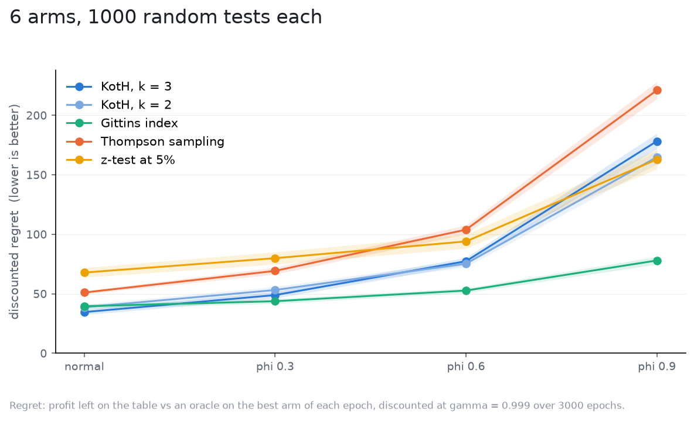

# Autocorrelated noise

Every strategy's filter takes each epoch's reading as fresh evidence. What if
the noise remembers? Each arm's standardized noise follows an AR(1),
`n_t = phi n_(t-1) + sqrt(1 - phi**2) z_t`, at `phi` 0.3, 0.6 and 0.9, with the
marginal variance held at `sigma**2`; nobody is told. A run of readings that
all lean the same way then carries less information than the filter credits
it with, and it credits every one in full.

Setup: 6 independent arms, effects drawn from `N(0, 0.5)`, `sigma = 1`,
`gamma = 0.999` (`1/rho = 1000` epochs) over 3000 epochs, flat priors, 1000
tests per world, the same tests in every world ([spec](spec.yaml)).

| noise | KotH, k = 3 | KotH, k = 2 | Gittins index | Thompson sampling | z-test at 5% |
|---|---|---|---|---|---|
| normal | 34.7 +/- 2.3 | 38.7 +/- 2.2 | 39.6 +/- 1.8 | 51.1 +/- 1.3 | 67.9 +/- 4.0 |
| phi 0.3 | 48.9 +/- 2.7 | 53.2 +/- 2.8 | 43.8 +/- 2.0 | 69.3 +/- 2.9 | 80.0 +/- 5.2 |
| phi 0.6 | 77.4 +/- 3.1 | 75.4 +/- 2.9 | 52.8 +/- 1.9 | 103.9 +/- 3.8 | 94.1 +/- 5.8 |
| phi 0.9 | 178.3 +/- 6.5 | 164.9 +/- 5.7 | 78.0 +/- 3.3 | 221.1 +/- 7.1 | 163.0 +/- 8.2 |

Discounted regret, mean and 95% CI.

What it says:

- This is the study that changes the ordering. Gittins loses 10% at
  `phi 0.3` and doubles at 0.9; KotH loses 40% at 0.3 and quintuples at 0.9,
  and Thompson goes the same way. At 0.9 the z-test, the worst strategy in
  every other world, beats koth.
- The mechanism, as read off the numbers and not measured directly: overconfidence with a direction. A run of correlated
  readings looks like consistent evidence, so the filter's precision climbs
  as if the readings were independent while its mean follows the run. Every
  strategy that splits its allocation is feeding several arms' noise runs
  into the same decision at once, and commits or re-splits on them. Gittins
  plays one arm at a time, so a run only misleads it about that arm, and its
  next reading of the others is fresh.
- The noise study priced an underestimated `sigma`; this is worse than that,
  because the error is not a constant factor but a pattern the filter reads
  as signal.

If your readings are autocorrelated (a metric with day-of-week structure,
sessions that span epochs, a slow-moving confounder), fix that before the
test, not in the strategy: aggregate to epochs long enough that consecutive
readings are independent, or difference out the structure. None of the
strategies here models it, and KotH is the one that pays most for pretending.
