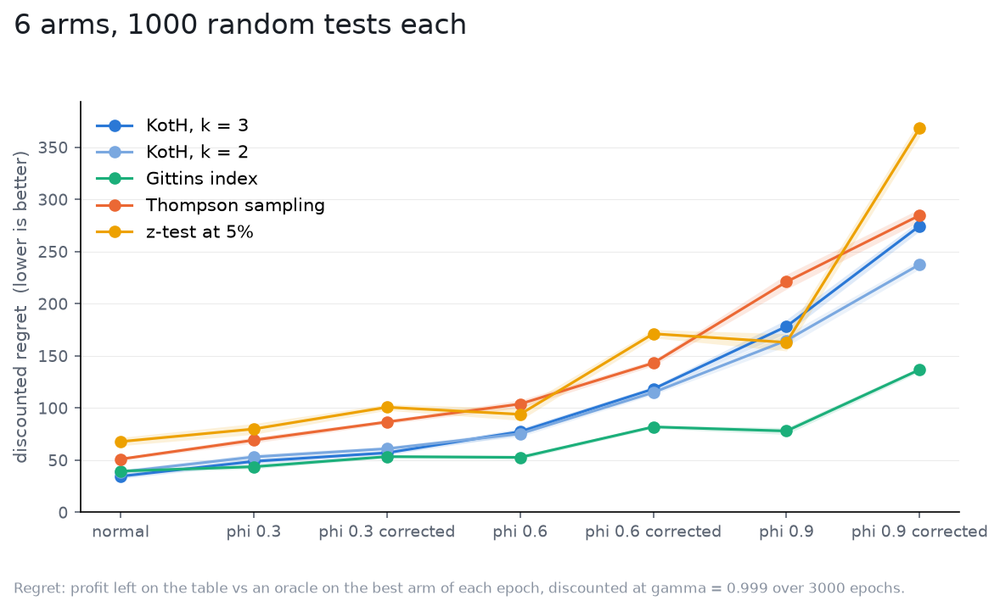

# Autocorrelated noise, with the "correction"

The [autocorrelation study](../autocorrelation/README.md) showed every
strategy overpaying once readings remember, because the filter credits each
reading as fresh. The obvious one-number fix: tell the strategies the
long-run noise of an AR(1) reading, `sigma * sqrt((1 + phi) / (1 - phi))`
(1.36 at `phi 0.3`, 2 at 0.6, 4.36 at 0.9), so that after many readings the
filter's precision matches what the readings' average is worth. This study
runs each world twice, plain and told the corrected `sigma`.

Setup as in the autocorrelation study ([spec](spec.yaml)); the world keeps
`sigma = 1`, the corrected strategies are told the long-run value.

| world | KotH, k = 3 | KotH, k = 2 | Gittins index | Thompson sampling | z-test at 5% |
|---|---|---|---|---|---|
| normal | 34.7 +/- 2.3 | 38.7 +/- 2.2 | 39.6 +/- 1.8 | 51.1 +/- 1.3 | 67.9 +/- 4.0 |
| phi 0.3 | 48.9 +/- 2.7 | 53.2 +/- 2.8 | 43.8 +/- 2.0 | 69.3 +/- 2.9 | 80.0 +/- 5.2 |
| phi 0.3 corrected | 57.1 +/- 2.1 | 61.1 +/- 2.0 | 53.5 +/- 1.5 | 86.7 +/- 1.8 | 100.8 +/- 2.9 |
| phi 0.6 | 77.4 +/- 3.1 | 75.4 +/- 2.9 | 52.8 +/- 1.9 | 103.9 +/- 3.8 | 94.1 +/- 5.8 |
| phi 0.6 corrected | 118.3 +/- 2.3 | 114.9 +/- 2.2 | 82.0 +/- 1.5 | 143.2 +/- 2.7 | 171.3 +/- 4.0 |
| phi 0.9 | 178.3 +/- 6.5 | 164.9 +/- 5.7 | 78.0 +/- 3.3 | 221.1 +/- 7.1 | 163.0 +/- 8.2 |
| phi 0.9 corrected | 274.7 +/- 5.0 | 237.7 +/- 4.5 | 136.9 +/- 2.2 | 284.8 +/- 6.1 | 368.4 +/- 8.1 |

Discounted regret, mean and 95% CI.

What it says:

- The correction makes everything worse, for every strategy, in every world:
  KotH by 17% at `phi 0.3` and 54% at 0.9, Gittins by 22% and 75%, Thompson
  by 25% and 29%.
- The factor is a statement about a long average, and the decisions that
  cost money are made on short ones. A first reading of an arm has variance
  `sigma**2` whatever `phi` is; a filter told `4.4 sigma` credits it with 5%
  of its worth, which is the "believe `sigma` 4x too high" case of the
  [noise study](../misspecified_sigma/README.md), priced there at three
  times the regret, and here it lands on top of the autocorrelation loss
  instead of replacing it.
- Scaling `sigma` cannot stand in for a filter that models the dependence.
  The right filter carries the noise's memory as state (an AR(1) component
  beside the effect), which none of these strategies has.

So the advice from the autocorrelation study stands and this study removes
the tempting shortcut: if your readings are autocorrelated, whiten the data
before the test (aggregate to epochs long enough that consecutive readings
are independent, or difference out the structure). Do not inflate `sigma`.
