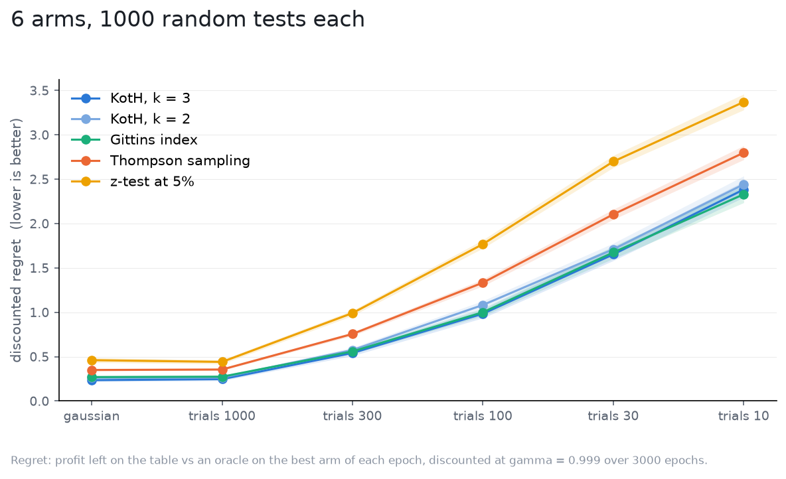

# Bernoulli data

The nets and every filter here assume Gaussian readings. A conversion test
gives you successes out of draws. How coarse can that get before the Gaussian
posterior stops describing it? Arms convert at 5% plus a lift; an epoch at
allocation `a` gives arm i `round(a_i * trials)` Bernoulli draws and reports
its success rate; the strategies are told `sigma = sqrt(0.05 * 0.95 / trials)`
and nothing else. The ladder is `trials` per epoch, 1000 down to 10, and a
Gaussian world at the 1000-draw `sigma` is the reference, so the first rung
changes only the shape of the noise.

Setup: 6 arms, lifts drawn from `N(0, 0.0035)` (a 7% relative lift sd on the
base rate) in every world, `gamma = 0.999` over 3000 epochs, flat priors, 1000
tests per world, the same tests in every world ([spec](spec.yaml)). Regret is
in rate units: 0.1 is ten percentage points of conversion, discounted, over
the test.

| draws per epoch | KotH, k = 3 | KotH, k = 2 | Gittins index | Thompson sampling | z-test at 5% |
|---|---|---|---|---|---|
| gaussian | 0.235 +/- 0.015 | 0.264 +/- 0.016 | 0.271 +/- 0.013 | 0.350 +/- 0.009 | 0.461 +/- 0.027 |
| 1000 | 0.247 +/- 0.018 | 0.264 +/- 0.015 | 0.274 +/- 0.014 | 0.355 +/- 0.011 | 0.441 +/- 0.024 |
| 300 | 0.542 +/- 0.031 | 0.575 +/- 0.028 | 0.559 +/- 0.027 | 0.756 +/- 0.021 | 0.992 +/- 0.030 |
| 100 | 0.984 +/- 0.049 | 1.083 +/- 0.047 | 1.001 +/- 0.043 | 1.334 +/- 0.039 | 1.768 +/- 0.047 |
| 30 | 1.653 +/- 0.071 | 1.711 +/- 0.067 | 1.675 +/- 0.070 | 2.104 +/- 0.057 | 2.699 +/- 0.068 |
| 10 | 2.385 +/- 0.089 | 2.442 +/- 0.094 | 2.330 +/- 0.095 | 2.799 +/- 0.079 | 3.371 +/- 0.089 |

Discounted regret, mean and 95% CI.

What it says:

- Binary readings cost nothing by themselves. At 1000 draws the Bernoulli
  world and its Gaussian twin agree within the CI for every strategy.
- Down the ladder regret grows, and it grows the way less data would in a
  Gaussian world: the `sigma` the strategies are told is right at every rung,
  so what changes is the signal-to-noise (from `muhat ≈ 16` at 1000 draws to
  1.6 at 10), and the ordering holds all the way down, KotH and Gittins
  together, Thompson a third behind, the z-test last.
- Nothing goes belly up. At 10 draws per epoch across 6 arms an arm sees one
  or two draws an epoch and its reading is 0 or 1, and the posterior does not
  care: it sums successes over 3000 epochs, and the Gaussian is a fine
  description of a rate with hundreds of successes behind it. Coarseness per
  epoch is not the question; total draws are, and those are what `sigma`
  already prices.

The commit rate does say something the regret hides: at 10 draws KotH commits
wrongly 57% of the time, against 12% in the Gaussian world. With lifts this
small relative to the noise, a wrong commit costs little, which is the regret
saying it correctly; but a team that reads the committed arm as "the winner"
is reading noise more than half the time at that rung.
