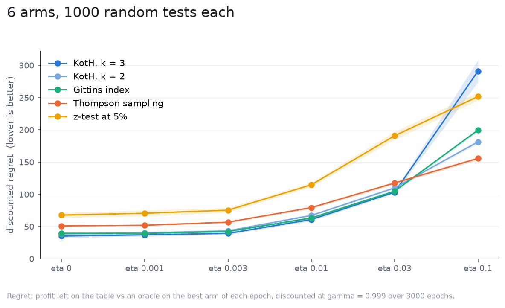

# Drift

The nets assume the true effects stay put. Here every arm's effect takes a
random step each epoch, of size `eta`, and the strategies are told `eta` (their
filter forgets at the right rate) but KotH's nets still solve the static
problem. In the nets' own units the drift is `eta / (rho sigma)`, the steps an
arm takes per unit of the discount horizon in units of what an epoch can
resolve: 1, 3, 10, 30 and 100 here, with 0 as the reference. For scale, a
production-like world sits around 10, and a harsh one around 30.

Setup: 6 independent arms, effects drawn from `N(0, 0.5)` at epoch 0,
`sigma = 1`, `gamma = 0.999` (`1/rho = 1000` epochs) over 3000 epochs, flat
priors, 1000 tests per world, the same tests in every world
([spec](spec.yaml)).

| drift (`eta`) | KotH, k = 3 | KotH, k = 2 | Gittins index | Thompson sampling | z-test at 5% |
|---|---|---|---|---|---|
| 0 | 35.3 +/- 2.5 | 38.7 +/- 2.2 | 39.6 +/- 1.8 | 51.1 +/- 1.3 | 67.9 +/- 4.0 |
| 0.001 | 37.2 +/- 2.6 | 40.2 +/- 2.3 | 39.5 +/- 1.8 | 52.0 +/- 1.3 | 70.7 +/- 4.5 |
| 0.003 | 39.4 +/- 2.1 | 43.4 +/- 2.2 | 42.5 +/- 1.6 | 56.9 +/- 1.4 | 75.5 +/- 3.7 |
| 0.01 | 61.0 +/- 2.2 | 67.3 +/- 2.3 | 63.4 +/- 1.6 | 79.5 +/- 1.7 | 114.9 +/- 3.5 |
| 0.03 | 103.3 +/- 2.3 | 110.0 +/- 2.4 | 105.0 +/- 1.9 | 117.7 +/- 2.2 | 191.0 +/- 6.4 |
| 0.1 | 291.1 +/- 17.1 | 181.3 +/- 2.9 | 199.6 +/- 2.5 | 155.8 +/- 2.8 | 251.7 +/- 6.3 |

Discounted regret, mean and 95% CI. Regret is against an oracle that follows
the moving winner, so it grows with drift for everyone.

What it says:

- Up to a production-like drift (`eta 0.01`, ten steps per horizon) the
  ordering holds and KotH stays ahead: 61 against Gittins' 63 and Thompson's
  80. The static solution with a forgetting filter is enough there.
- At `eta 0.03` KotH and Gittins tie and Thompson closes in; at `eta 0.1`,
  a winner that flips several times per horizon, KotH k = 3 breaks: 291 with a
  wide CI, so a tail of tests where it commits to an arm and the world moves
  on while it sits at the vertex. KotH k = 2 (181) does not, and Thompson,
  which never commits, is the best strategy there (156).
- A commit is absorbing under a static model: at a vertex the other arms get
  no data, and only the filter's forgetting can lift them back. It does, but
  late. That is the one regime in this chapter where "not a stopping rule"
  matters in practice: with drift this heavy, do not let it sit.

KotH is built for a world that moves at most a few times per horizon, which is where A/B tests live, and it pays a premium beyond that.
