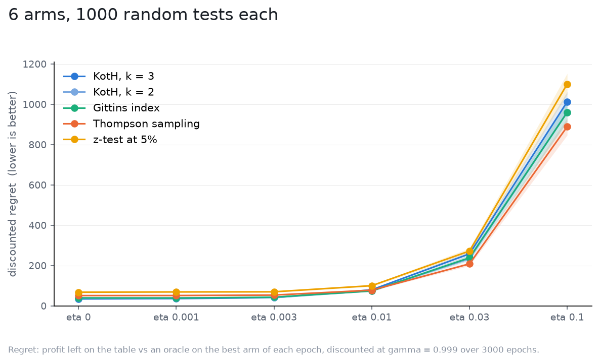

# Drift, with a filter that does not know

The [drift study](../drift/README.md) told every strategy the world's `eta`,
so their posteriors forgot at the right rate and only KotH's nets were static.
Here nobody is told: the filter runs with `eta = 0`, as a user who never
modelled drift would run it, and its precision keeps climbing on an arm whose
effect has long since moved.

Setup as in the drift study: 6 independent arms, effects `N(0, 0.5)` at
epoch 0, `sigma = 1`, `gamma = 0.999` over 3000 epochs, flat priors, 1000
tests per world, the same tests as the aware run ([spec](spec.yaml)).

| drift (`eta`) | KotH, k = 3 | KotH, k = 2 | Gittins index | Thompson sampling | z-test at 5% |
|---|---|---|---|---|---|
| 0 | 34.7 +/- 2.3 | 38.7 +/- 2.2 | 39.6 +/- 1.8 | 51.1 +/- 1.3 | 67.9 +/- 4.0 |
| 0.001 | 36.2 +/- 2.4 | 39.5 +/- 2.3 | 38.9 +/- 1.8 | 51.4 +/- 1.3 | 69.4 +/- 4.4 |
| 0.003 | 41.0 +/- 2.9 | 41.1 +/- 2.3 | 43.2 +/- 2.0 | 53.7 +/- 1.4 | 70.0 +/- 3.7 |
| 0.01 | 79.8 +/- 4.4 | 74.8 +/- 3.7 | 74.2 +/- 3.6 | 78.0 +/- 2.6 | 100.3 +/- 4.2 |
| 0.03 | 258.2 +/- 12.4 | 234.1 +/- 11.4 | 238.7 +/- 12.4 | 208.5 +/- 9.4 | 272.3 +/- 13.0 |
| 0.1 | 1012.9 +/- 49.6 | 960.8 +/- 47.0 | 960.6 +/- 49.8 | 889.4 +/- 42.8 | 1100.9 +/- 52.1 |

Discounted regret, mean and 95% CI. For comparison, the aware filter at
`eta 0.01`: KotH 61, Gittins 63, Thompson 80; at 0.03: 103, 105, 118.

What it says:

- Up to `eta 0.003` it makes no difference: the world moves too little for the
  forgetting to matter within a horizon.
- From `eta 0.01` the unaware filter costs everyone, and it costs the
  committing strategies most: KotH and Gittins at 0.01 lose 30% and 17% more
  than their aware selves, Thompson nothing, and at 0.03 the field collapses
  to within 20% of each other at two and a half times the aware regret. At
  0.1 every strategy is 5x its aware self and the ordering is noise.
- The mechanism is the filter alone. An unaware posterior's precision grows
  without bound, so a strategy that has stopped sampling an arm never doubts
  it again, and a strategy that keeps sampling (Thompson) at least sees the
  move in its mean. Telling the filter `eta` is what let the aware run keep
  its ordering up to a production-like drift.

Two numbers, then. If your effects move, the filter's `eta` is worth more
than the choice of strategy from `eta 0.01` up (30% for KotH at 0.01, a
factor of 2.5 at 0.03), and the package does not carry one: `State.update`
is the static conjugate step. Until it does, the forgetting is yours to add
between epochs (scale the covariance up by `1 + eta^2 precision` before each
`observe`), or the test should be short enough that the world does not move.
