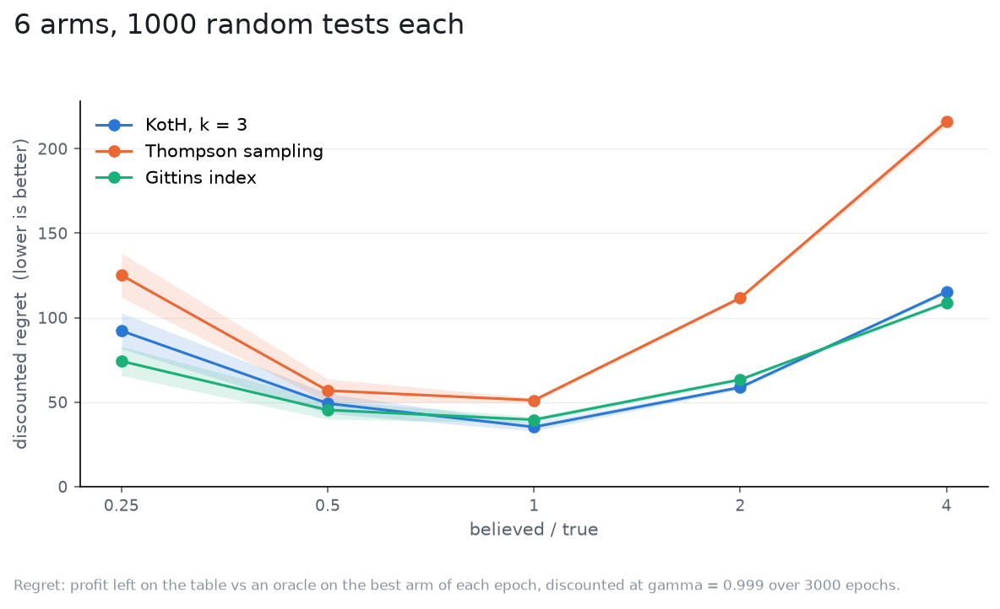

# Misjudging the noise

`sigma` is the one number a user must supply that the data does not hand over,
so: what does it cost to get it wrong? Each strategy was run believing `sigma`
to be 0.25, 0.5, 1, 2 and 4 times its true value, everything else equal. The
belief enters the strategy's filter and, for KotH, its `Test`; the world does
not change.

Setup: 6 independent arms, true effects drawn from `N(0, 0.5)`, true
`sigma = 1`, `gamma = 0.999` (`1/rho = 1000` epochs) over 3000 epochs, flat
priors, 1000 tests per point, the same tests for every point
([spec](spec.yaml)).

| believed / true | KotH, k = 3 | Thompson sampling | Gittins index |
|---|---|---|---|
| 0.25 | 92.2 +/- 10.6 | 125.1 +/- 13.1 | 74.3 +/- 8.5 |
| 0.5 | 49.2 +/- 5.9 | 56.8 +/- 6.9 | 45.4 +/- 5.4 |
| 1 | **35.3 +/- 2.5** | 51.1 +/- 1.3 | 39.6 +/- 1.8 |
| 2 | 58.7 +/- 1.1 | 111.7 +/- 1.4 | 63.3 +/- 1.0 |
| 4 | 115.3 +/- 1.3 | 216.1 +/- 2.7 | 108.8 +/- 1.2 |

Discounted regret, mean and 95% CI.

What it says:

- Both directions cost, and a factor of 2 either way costs of the order of
  half again: KotH loses 39% more at 0.5x and 66% more at 2x, Gittins 15% and
  60%, Thompson 11% and 119%.
- Overestimating is where Thompson breaks: it keeps exploring after the answer
  is in, and at 4x it loses four times what it does at the truth. KotH and
  Gittins lose three times.
- Underestimating hurts KotH and Thompson more than Gittins. An overconfident
  strategy commits early on noise; Gittins, which plays one arm at a time,
  changes its mind cheaper than a strategy that has already split its
  allocation.
- At the truth KotH beats both; Gittins catches it only once the noise is
  misjudged by 4x, and Thompson at no ratio in the sweep.

If `sigma` is uncertain, the error is symmetric enough that guessing low or
high is no better than the other; getting within a factor of 2 is what
matters.
