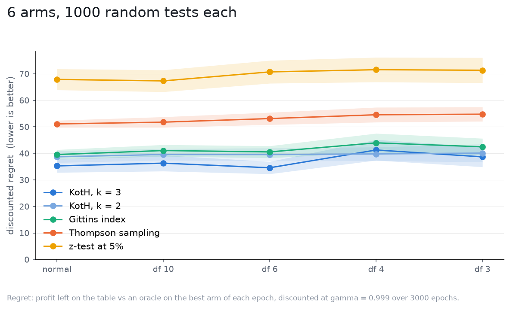

# Outliers

The nets were trained on Gaussian noise. What happens when the readings have
heavy tails? The observation noise is a Student-t at 10, 6, 4 and 3 degrees
of freedom, scaled to the same variance as the Gaussian (`sigma**2`, which is
why it stops at 3), so the strategies' model is wrong in shape only: the
occasional reading is far out, and the fewer the degrees of freedom the
farther and the more often. Nobody is told.

Setup: 6 independent arms, true effects drawn from `N(0, 0.5)`, `sigma = 1`,
`gamma = 0.999` (`1/rho = 1000` epochs) over 3000 epochs, flat priors, 1000
tests per world, the same tests in every world ([spec](spec.yaml)).

| noise | KotH, k = 3 | KotH, k = 2 | Gittins index | Thompson sampling | z-test at 5% |
|---|---|---|---|---|---|
| normal | 35.3 +/- 2.5 | 38.7 +/- 2.2 | 39.6 +/- 1.8 | 51.1 +/- 1.3 | 67.9 +/- 4.0 |
| df 10 | 36.3 +/- 3.0 | 39.6 +/- 2.2 | 41.1 +/- 2.2 | 51.8 +/- 2.0 | 67.3 +/- 4.1 |
| df 6 | 34.6 +/- 2.3 | 39.6 +/- 2.4 | 40.6 +/- 2.3 | 53.1 +/- 2.3 | 70.7 +/- 4.3 |
| df 4 | 41.3 +/- 3.9 | 39.8 +/- 2.6 | 44.0 +/- 3.5 | 54.6 +/- 2.8 | 71.5 +/- 4.6 |
| df 3 | 38.7 +/- 3.8 | 40.1 +/- 3.4 | 42.5 +/- 3.2 | 54.8 +/- 2.7 | 71.3 +/- 4.7 |

Discounted regret, mean and 95% CI.

What it says:

- Nobody cares much. From Gaussian to `df 3` every strategy loses 5-10%
  more, within or near its CI, and the ordering does not move: KotH, then
  Gittins, then Thompson, then the z-test.
- The mechanism is the filter: every strategy here averages readings over
  many epochs, and at equal variance the average of heavy-tailed readings
  converges like the average of Gaussian ones. An outlier costs one epoch of
  misallocation, not a wrong commit.
- What would hurt is what this sweep holds fixed: an outlier that also
  inflates the variance beyond what `sigma` says, which is the previous
  study's overestimation case, or a noise whose variance does not exist
  (`df <= 2`), where averaging stops working for everyone.
